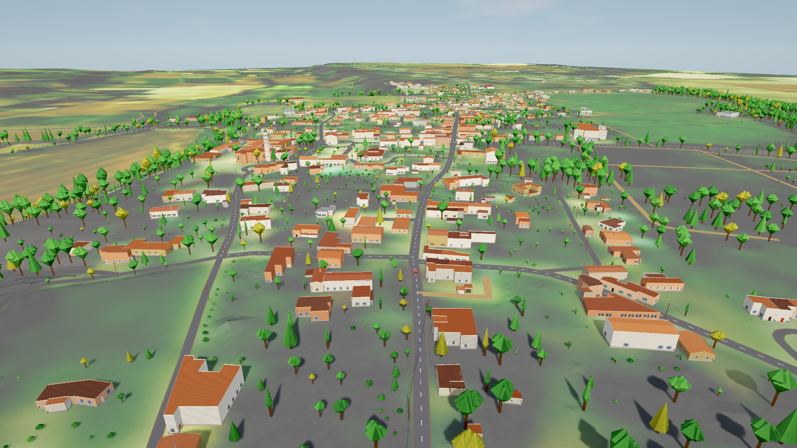
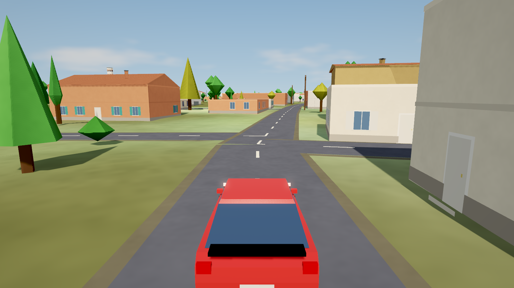
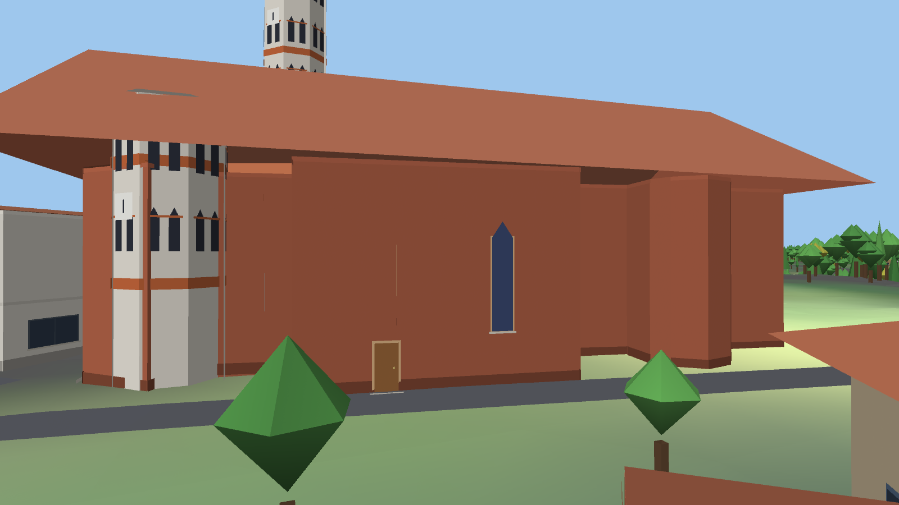
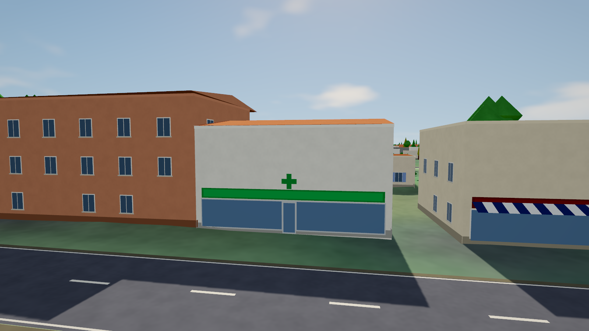
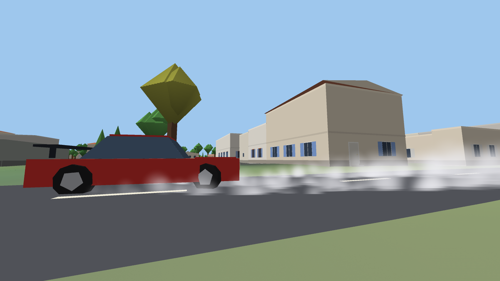
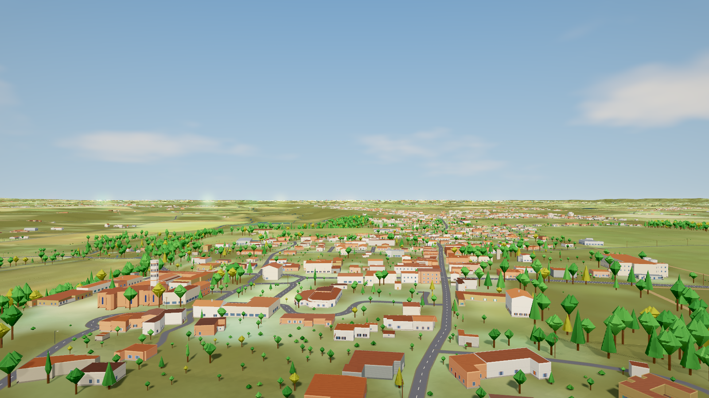
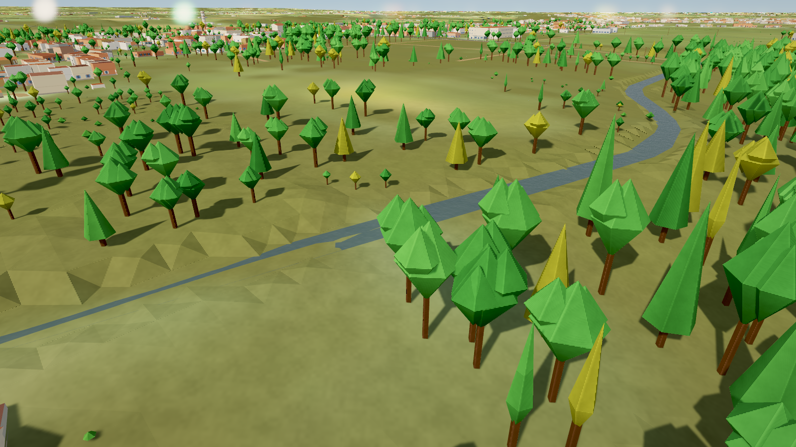
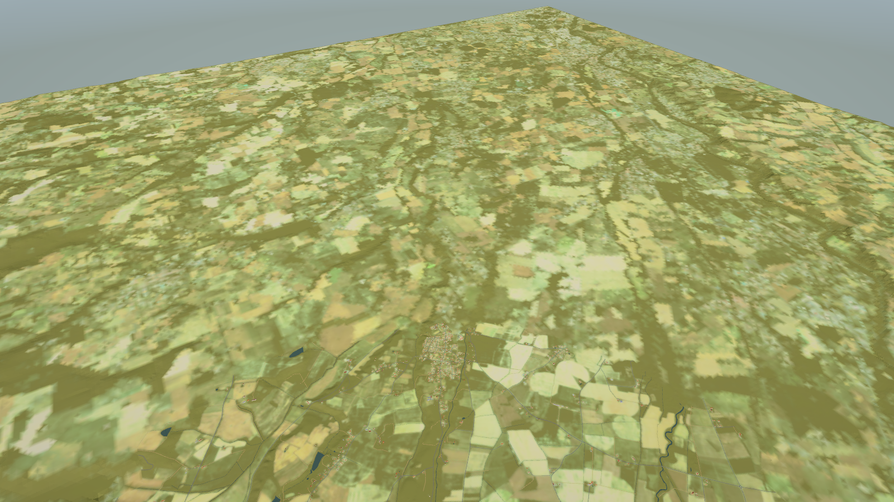
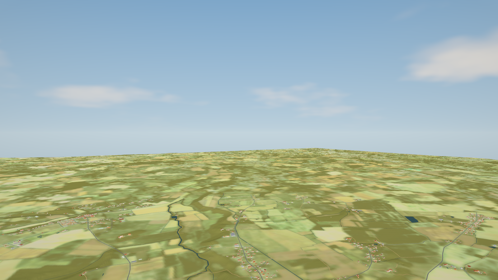

# Berat Racer

A low-poly, sim-arcade driving game set on the **real roads and terrain of Bérat (31370), Haute-Garonne**, built from French open geodata: IGN **LiDAR HD** elevation, **BD TOPO** roads and buildings, IGN orthophotos and OpenStreetMap. **About 1,000 km² (32 x 32 km) are playable** and streamed in chunks, in Unity 6 (macOS / Apple Silicon tested).



| | |
|---|---|
|  |  |
|  |  |
|  |  |
|  |  |

## What is in it

- **Real world**: the terrain follows the LiDAR bare-earth model; roads come from the BD TOPO centrelines with their surveyed widths (drawn 27 % wider) and OpenStreetMap attributes, rebuilt by a road pipeline (`tools/roads`, see `docs/roads.md`): smooth curves that stay within 1.5 m of the survey, real junction surfaces with rounded kerbs (nothing overlaps), one height profile for the whole network with limits on grade and on crest / sag radius, level bridge decks (from the LiDAR *surface* model), terrain shaped around the roads, painted centre and edge lines, gravel verges.
- **Procedural buildings**: BD TOPO footprints (about 60,000 in the whole map) (cut out of every road corridor) with facades chosen per building type (house, barn, shop, pharmacy, town hall, school, church...), gable roofs only where the roof truly fits, regional colours (crépi, brique foraine, canal tiles). Types come from BD TOPO plus OSM places (Pharmacie Vert Nature, Mairie, Église Saint-Pierre with its octagonal tower...). See `docs/berat-style-guide.md`.
- **A 1,000 km² world, streamed** (`WorldBuilder`, `ChunkMeshes`, `tools/build_world.py`): the map is cut into 400 m chunks. Everything within **5 km** of the car is loaded (16 m terrain, roads, building shells, water); within **1.6 km** it gets full detail (4 m terrain, road markings, facades, trees, hedges, poles, building colliders). The whole map out to **50 km** stays resident as a 64 m terrain with the orthophoto colours (forests and villages included). Chunks are read, parsed and meshed on worker threads; the main thread only creates Unity objects, a few ms per frame, and holds the car still if it ever outruns the terrain.
- **Water**: BD TOPO ponds, reservoirs, river surfaces, streams and canals, with levels taken from the LiDAR ground and a channel carved into the terrain. Animated, translucent water shader with sun glint and sky reflection; driving through it slows the car (drag, less grip, spray).
- **Nature and street furniture**: 55,000 trees and 21,000 hedges / shrubs at the LiDAR canopy maxima, lamp posts in the village, utility poles with wires in the country. Nothing solid stands on a road.
- **Three cars, three characters** (`CarSpec.cs`): a Hot Hatch (RWD), a **Peugeot 406 V6** (FWD saloon, soft ride) and a **Porsche 911 GT3 (992)** (rear-engine, 9000 rpm, big wing and downforce). `F` switches car.
- **Vehicle dynamics** (`CarController`, `Tyre`, `Drivetrain`): per-wheel angular velocity with slip ratio and slip angle from the contact-patch velocity; a combined-slip tyre curve with load sensitivity and lateral relaxation; engine torque curve, clutch (solved exactly against the driven axle each step), automatic gearbox, open / limited-slip differential; ABS, traction control and slip-angle-limited steering; springs, dampers and anti-roll bars over a contact envelope rolled across the heightfield; the whole hull collides with the ground.
- **Look**: real sun with cascaded soft shadows, sky-gradient ambient, a procedural sky with clouds, haze, glossy paint and glass, HDR + MSAA + bloom + ACES tone mapping, fine grain on fields / asphalt / walls, far-terrain level of detail.
- **Speed feel** (`docs/speed-feel-research.md`): FOV 70 -> 100 deg with speed, look-ahead, acceleration pull-back, shake, radial blur + vignette, procedural engine / wind / tyre audio, tyre smoke and skid marks, controller rumble.
- **Cameras**: chase, close chase, hood, bumper, far chase; free look that orbits the car; rear view.
- **Map mode**: 10 m ... 10 km zoom (3 steps per decade), pan with WASD / stick or by dragging with the mouse (a quick click that does not move teleports; holding still does nothing), pan clamped to the map border, 5 m grid overlay when zoomed in, teleport to the exact terrain height under the crosshair.
- **Minimap** (bottom-left, heading-up, roads and buildings without tree canopy, north marker): `Z` cycles the range 120 m / 250 m / 500 m / 1 km.
- **Bug-report coordinates**: the top-right box shows the 5 x 5 m cell, local metres, elevation and Lambert-93. `K` copies the spot, `J` jumps to coordinates on the clipboard, `-goto x,z` starts there.
- **Autopilot** that follows the real road network (demo and test driver).

## Physics results (headless test suite, `docs/physics-*.txt`)

| | Hot Hatch | Peugeot 406 V6 | Porsche 911 GT3 |
|---|---|---|---|
| 0-100 km/h | 6.8 s | 9.1 s | 3.8 s |
| top speed | 246 km/h | 236 km/h | 305 km/h |
| 100-0 km/h | 34 m | 39 m | 27 m |
| skidpad, R = 30 m | ~1.0 g | 0.86 g | 1.35 g |

Each car passes 13 checks (acceleration, braking distance and stability, skidpad grip, handbrake turn, hands-off stability at speed, step-steer gain and overshoot). The previous model passed 5 of 13.
Road benchmark (autopilot, 150 s on the real roads): invisible stops 3 -> 0, vertical harshness 0.15 m/s2 (terrain-mesh level), no wheel hops. Whole-hull collision is tested by dropping each car on its side, roof, nose and tail.

## Controls

| | Keyboard / mouse | DualSense / gamepad |
|---|---|---|
| Drive | W A S D / arrows | R2 gas, L2 brake / reverse, left stick |
| Handbrake | Space | Square or R1 |
| Reset car | R | Triangle |
| Car | F | D-pad right |
| Camera | C, hold B = rear view, hold right mouse = look | D-pad up, right stick = look, R3 = rear view |
| Map | M (Enter / click = teleport, Q E zoom, WASD pan) | Select (Cross = teleport, L1 R1 zoom, left stick pan) |
| Autopilot | P | Circle |
| Spot | K copy, J jump to clipboard coordinates | |
| Assists / v-sync / debug | T / V / F3 | |
| Volume / mute | `[` `]` / N | |
| Quit | Esc | |

## Run it

0. **Just want to play?** Download `BeratRacer-macos-arm64.zip` from the [latest release](../../releases/latest) (Apple Silicon; unsigned, so right-click ▸ Open the first time, or `xattr -cr` it). It contains the berat70 map (70 x 70 km, new road pipeline).
1. Get the map data into `world/`: either `tools/fetch_world.sh` (downloads the berat70 world of the latest release, ~1.9 GB, a few minutes), or generate it yourself (about 30-60 min of downloading plus processing; see *Build the map data* below). It is not committed.
2. Install Unity **6000.0.84f1** (Apple Silicon build), open the `unity/` folder, run *Berat ▸ Build macOS* (or `BuildTools.BuildMac` in batch mode; `-world path/to/world_x` packs another world than `world/`).
3. Launch `Build/BeratRacer.app`. Logs: `~/Library/Logs/BeratRacer/berat.log`.

## Build the map data

```sh
uv sync
cd tools
uv run python fetch_big.py        # LiDAR HD MNT/MNH (2 m) + orthophoto (4 m), 900 tiles, resumable  -> tools/data/big
uv run python fetch_vectors.py    # BD TOPO roads, buildings, hydrography + OSM points of interest, 10 x 10 sectors, resumable
uv run python -m roads build      # roads of the area -> data/big/roads/ (default area: the 10 x 10 km "small" map; docs/roads.md)
uv run python build_world.py --list data/big/small_sectors.json --out ../world_small --far-cache data/big/far_small_v2.npz
uv run python check_roads.py ../world_small      # no terrain above a road, every road end meets its junction
```

Run the player on a generated world with `BERAT_WORLD=/path/to/world_small`. The 1,000 km² and region worlds in `world/` predate the road pipeline (it solves one build area at a time, sized for the small map so far); they still load, with their old roads.

`build_world.py` processes the sectors of 3.2 km in parallel, each with a 240 m margin so borders match exactly (`--sectors 4:4,5:5` for a subset, `--jobs N`). The area is `CX`, `CY` in `tools/fetch.py` (Lambert-93) and `HALF` in `fetch_big.py`: change them to build a different place in France.

## Headless tests

The player has scripted test modes (run with `-batchmode`): `-phystest -car N` (13 vehicle-dynamics checks), `-roadtest` (drive the real roads and measure jolts, wheel hops and phantom stops), `-hulltest` (whole-car ground collision), `-bridgetest`, `-audit` (obstacle clearances), `-gridtest`, `-inputtest`, `-maptest`, `-camtest`, `-shots`, `-worldshots` (streaming showcase: chase, long view, 8 km overview, 40 km horizon, water), `-carshots`, `-smokeshots`, `-audiotest`, `-smoke -smokeSeconds N [-autoKmh K]`. `-autopilot` starts the game driving itself, `-car N` picks the car, `-vsync` caps the frame rate.

## Data & attribution

The map is derived from open data. Please keep the attribution if you reuse it:

- **IGN LiDAR HD, BD TOPO®, orthophotos**: © IGN, published under the *Licence Ouverte / Open Licence 2.0* (Etalab). Check the current terms on <https://geoservices.ign.fr>.
- **OpenStreetMap**: © OpenStreetMap contributors, ODbL <https://www.openstreetmap.org/copyright>.
- Source code: MIT (see `LICENSE`).

No game assets were copied from other games; everything is generated in code at runtime. The Bérat style guide was written from public photographs (Wikimedia Commons and street-level pages); the URLs are listed in `docs/berat-style-guide.md`.
